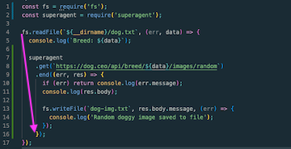
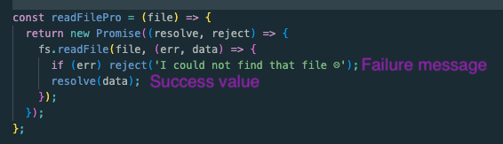
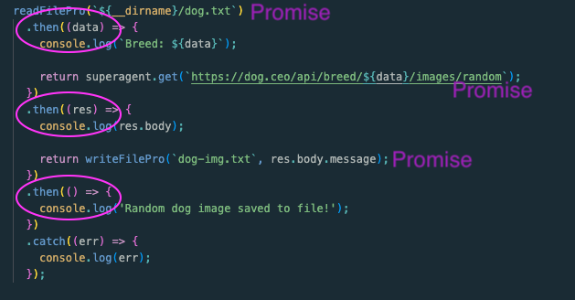

# Node Doggy

This is a little demonstration of async/await and promises in Node JS

## Things I learned

- Spent quite a bit of time chasing down a 404 error from the API

  ```
      {
      status: 'error',
      message: 'Breed not found (master breed does not exist)',
      code: 404
      }
  ```

  The issue was an extra line in the dog.txt file where the Breed: ${data} was being pulled from. I had just done a return after putting in the word hound. Structure matters! 😉

- First exercise is to create a callback hellscape 😣
  This is where many callback functions are nested. None of them are asynchronous and things can get messy fast. Look for the "triangle" that is being made in the code with indents of nested callbacks.

  

- Promise chain consists of a .get() .then() and .catch(). To promise-ify a process use Promise() which gives a failure message or success value. Once the promise is resolved the success value can be used at some future point. This is why this is asynchronous.

  

  The previous callback functions can all be turn into a promise chain. With a return of a promise value an .then() can be added with the next step and next promise.

  

## Useful Links

[Dog CEO API](https://dog.ceo/dog-api/documentation/breed) - fun API used to generate dog images and breed names

[Super Agent ](https://www.npmjs.com/package/superagent) - module for handling Promises/Callback functions

[Promise()](https://developer.mozilla.org/en-US/docs/Web/JavaScript/Reference/Global_Objects/Promise) - Mozilla documentation
